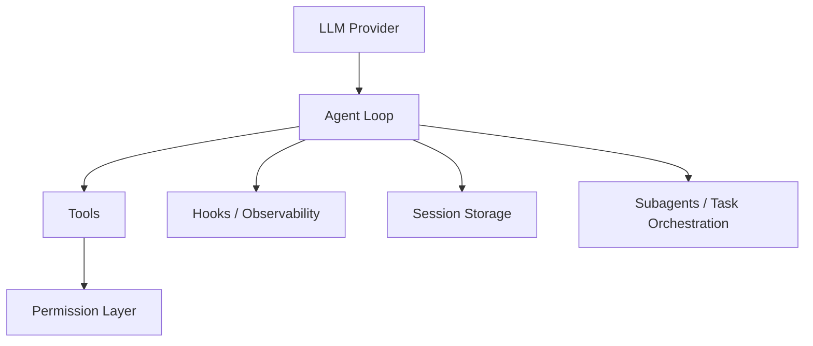

<div align="center">
  

  <h1>Open Agent SDK</h1>

  <p><strong>Build production AI agents in TypeScript with tool use, permissions, and multi-provider support.</strong></p>

  <p>
    <a href="https://opensource.org/licenses/MIT"></a>
    <a href="https://www.typescriptlang.org/"></a>
    <a href="https://bun.sh/"></a>
  </p>
</div>

Lightweight open-source alternative to Claude Agent SDK concepts, focused on permissioned runtime and practical agent workflows.

## 1-Minute Quickstart

```bash
npx open-agent-sdk@alpha init my-agent
cd my-agent
npm install
cp .env.example .env
npm run dev
```

Or with Bun:

```bash
bunx open-agent-sdk@alpha init my-agent
```

## What You Can Build

- Coding agents (read repo, edit files, run commands, validate changes)
- Research agents (search, fetch, summarize, and structure outputs)
- CLI copilots (interactive sessions with resumable history)
- Permissioned automation workflows (control risky tools at runtime)

## Why Open Agent SDK

- Permissioned runtime by default: control tool execution with 4 explicit modes.
- Extensibility primitives: hooks, skills, subagents, and MCP-compatible tools.
- Reproducible eval path: local SWE-bench and Terminal-bench harnesses.

### Permission System (Core Differentiator)

```ts
const session = await createSession({
  provider: "openai",
  model: "gpt-5.3-codex",
  apiKey: process.env.OPENAI_API_KEY,
  permissionMode: "default", // or: plan | acceptEdits | bypassPermissions
  canUseTool: async (toolName, input) => {
    if (toolName === "Bash") return { behavior: "deny", message: "Bash blocked in this environment" };
    if ((toolName === "Write" || toolName === "Edit") && String(input.file_path || "").startsWith("src/")) {
      return { behavior: "allow" };
    }
    return { behavior: "ask" };
  },
});
```

See permission API details in [API Reference](./docs/api-reference.md#permissions).

See details in:
- [API Reference](./docs/api-reference.md)
- [SWE-bench Guide](./benchmark/swebench/README.md)
- [Terminal-bench Guide](./benchmark/terminalbench/README.md)
- [Benchmarks](./BENCHMARKS.md)

## Architecture



## Demo (Updating)

Demo assets will be refreshed with a coding-agent run sequence.

- Current runnable scripts: [Demo Gallery](./DEMO_GALLERY.md)
- Upcoming featured demo: repo read -> test -> patch -> re-test

## Example Gallery

- [Interactive Code Agent CLI](./examples/code-agent/README.md)
- [Quickstart Tests (basic/session/tools)](./examples/quickstart/README.md)
- [Skill System Demo](./examples/README.md#skill-system-demo)
- [Structured Output Demo](./examples/structured-output-demo.ts)
- [File Checkpoint Demo](./examples/file-checkpoint-demo.ts)

## Evaluation

- SWE-bench Lite smoke/batch runners: `benchmark/swebench/scripts/`
- Terminal-bench Harbor adapter and runbook: `benchmark/terminalbench/`
- Result summarization scripts and artifacts: see [BENCHMARKS.md](./BENCHMARKS.md)

## Integrations

Current provider support in core SDK:

- OpenAI
- Google Gemini
- Anthropic

Ecosystem integrations:

- MCP server integration support
- Harbor adapter for Terminal-bench

## Docs

- Homepage: https://openagentsdk.dev
- Docs: https://docs.openagentsdk.dev
- GitHub: https://github.com/OasAIStudio/open-agent-sdk
- [Introduction](./docs/introduction.md)
- [Comparison with Claude Agent SDK](./docs/claude-agent-sdk-comparison.md)

## Monorepo Layout

```text
packages/
  core/        # SDK implementation
  web/         # product homepage (Next.js)
  docs/        # docs site (Astro + Starlight)
examples/      # runnable examples
benchmark/     # eval harness and scripts
docs/          # engineering docs, workflows, ADRs
```

## Development

```bash
# install dependencies
bun install

# build core package
bun run build

# run tests
bun test

# run coverage
bun test --coverage

# type check
bun run typecheck
```

Integration tests with real LLM APIs:

```bash
env $(cat .env | xargs) bun test
```

## Project Status

Current release line: `0.1.0-alpha.x`.

The repository is under active development. APIs may evolve before stable `1.0.0`.

## Contributing

Please read [CONTRIBUTING.md](./CONTRIBUTING.md) before opening PRs.

## License

[MIT](./LICENSE)
