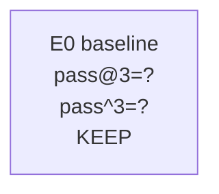

# Autoresearch Report Template

Copy this file to a run-specific report such as
`benchmark/autoresearch/reports/<date>-smoke5.md` before starting a campaign.

Use this markdown file as working notes only. The review artifact that should be
shared in PRs and experiment summaries is the companion HTML report copied from
`benchmark/autoresearch/report-template.html`.

## Summary

- Campaign:
- Branch:
- Task list:
- Model:
- Default k:
- Best experiment:
- Best pass@k:
- Best pass^k:
- Best avg_trial_rate:

## Commands

```bash
# Pre-warm current code into task images
bash benchmark/terminalbench/prewarm-images.sh \
  --tasks-file benchmark/terminalbench/task-lists/smoke-5.txt \
  --pack-local-tarballs \
  --force

# Run an experiment against the pre-warmed images
bash benchmark/autoresearch/run-experiment.sh \
  --tag "E0-baseline" \
  --no-local-tarballs \
  -k 3
```

## Experiment Tree



## Experiments

### E0

- Parent:
- Tag:
- Commit:
- Hypothesis:
- Files changed:
- Command:
- k:
- pass@k:
- pass^k:
- avg_trial_rate:
- Decision:
- Notes:

### E1

- Parent:
- Tag:
- Commit:
- Hypothesis:
- Files changed:
- Command:
- k:
- pass@k:
- pass^k:
- avg_trial_rate:
- Decision:
- Notes:
