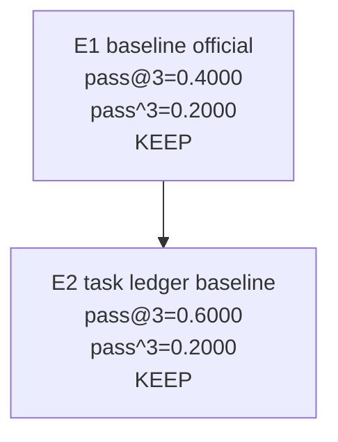

# Smoke-5 Autoresearch Campaign

## Summary

- Campaign: smoke-5 autoresearch
- Branch: exp/autoresearch-smoke5-run
- Task list: benchmark/terminalbench/task-lists/smoke-5.txt
- Model: MiniMax-M2.5
- Default k: 3
- Best experiment: E2-baseline-smoke5-k3-task-ledger
- Best pass@k: 0.6000
- Best pass^k: 0.2000
- Best avg_trial_rate: 0.4000

## Commands

```bash
bash benchmark/terminalbench/prewarm-images.sh \
  --tasks-file benchmark/terminalbench/task-lists/smoke-5.txt \
  --pack-local-tarballs \
  --force

HARBOR_BIN=$HOME/.local/share/oas-harbor/bin/harbor \
bash benchmark/autoresearch/run-experiment.sh \
  --tag "E2-baseline-smoke5-k3-task-ledger" \
  --no-local-tarballs \
  -k 3
```

## Experiment Tree



<<<<<<< HEAD
## Visual Review

### Legend

- `P`: one trial passed
- `F`: one trial finished but did not meet verifier thresholds
- `E`: one trial hit an infrastructure/runtime error

### Experiment Roles

| Experiment | What it did | Agent behavior changed? | Why it matters |
| --- | --- | --- | --- |
| `E1` | Ran the first official `smoke-5, k=3` baseline on the fast path | No | Established the first trustworthy baseline under the pre-warmed workflow |
| `E2` | Added task-level logging and reran the baseline | No | Made stability visible per task instead of only reporting one aggregate number |

### Metric Snapshot

| Experiment | Commit | pass@3 | pass^3 | avg_trial_rate | Meaning |
| --- | --- | --- | --- | --- | --- |
| `E1` | `7b84d8a` | `0.4000` | `0.2000` | `0.2667` | 2/5 tasks solvable at least once, 1/5 stable |
| `E2` | `45dead9` | `0.6000` | `0.2000` | `0.4000` | 3/5 tasks solvable at least once, 1/5 stable |

### Task Stability Map

| Task | E2 status | pass@3 | pass^3 | Reading |
| --- | --- | --- | --- | --- |
| `fix-git` | `PPP` | `1` | `1` | solved reliably |
| `configure-git-webserver` | `FFF` | `0` | `0` | unsolved |
| `llm-inference-batching-scheduler` | `FFP` | `1` | `0` | can solve, not stable |
| `gpt2-codegolf` | `FFF` | `0` | `0` | unsolved |
| `prove-plus-comm` | `EPP` | `1` | `0` | usually solvable, one runtime error |

### Read This As

- `E1` was the first real baseline.
- `E2` did not make the agent smarter; it made the campaign reviewable.
- The first actual optimization candidate starts after `E2`.

=======
>>>>>>> 8a14571 (chore(autoresearch): record E2 smoke-5 baseline)
## Experiments

### E1

- Parent:
- Tag: E1-baseline-smoke5-k3-official
- Commit: 7b84d8a
- Hypothesis: establish the first official smoke-5 k=3 baseline on the fast path
- Files changed: none in agent behavior under test
- Command: `bash benchmark/autoresearch/run-experiment.sh --tag E1-baseline-smoke5-k3-official --no-local-tarballs -k 3`
- k: 3
- pass@k: 0.4000
- pass^k: 0.2000
- avg_trial_rate: 0.2667
- Decision: KEEP
- Notes: first full fast-path baseline after timeout alignment and pre-warmed image workflow

### E2

- Parent: E1
- Tag: E2-baseline-smoke5-k3-task-ledger
- Commit: 45dead9
- Hypothesis: add task-level logging so each smoke-5 task exposes its own stability pattern
- Files changed: `benchmark/autoresearch/evaluate.sh`, `benchmark/autoresearch/run-experiment.sh`, `benchmark/autoresearch/README.md`, `benchmark/autoresearch/protocol.md`
- Command: `HARBOR_BIN=$HOME/.local/share/oas-harbor/bin/harbor bash benchmark/autoresearch/run-experiment.sh --tag E2-baseline-smoke5-k3-task-ledger --no-local-tarballs -k 3`
- k: 3
- pass@k: 0.6000
- pass^k: 0.2000
- avg_trial_rate: 0.4000
- Decision: KEEP
- Notes: this was primarily a logging/reporting change, not an intended agent-behavior optimization. Task-level results were `PPP`, `FFF`, `FFP`, `FFF`, `EPP` for `fix-git`, `configure-git-webserver`, `llm-inference-batching-scheduler`, `gpt2-codegolf`, and `prove-plus-comm`.
