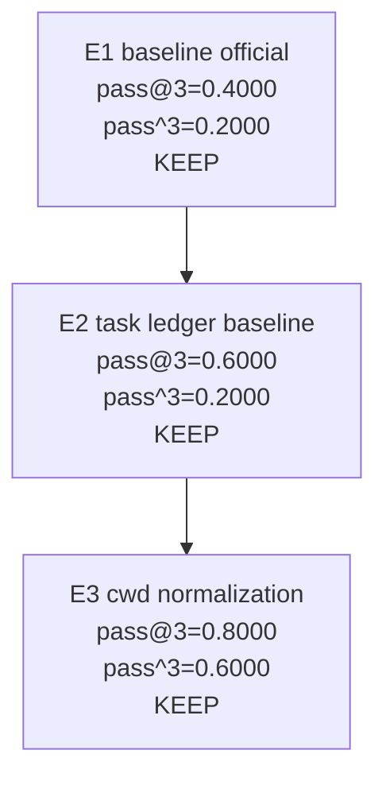

# Smoke-5 Campaign: E3

## Summary

- Campaign: smoke-5 autoresearch
- Branch: exp/autoresearch-smoke5-e3
- Model: MiniMax-M2.5
- Current best experiment: E3-cli-cwd-normalization
- Best pass@3: 0.8000
- Best pass^3: 0.6000
- Best avg_trial_rate: 0.6667

## Commands

```bash
bun test packages/cli/tests

HARBOR_BIN=$HOME/.local/share/oas-harbor/bin/harbor \
bash benchmark/autoresearch/run-experiment.sh \
  --tag E3-cli-cwd-normalization \
  -k 3
```

## Experiment Tree



## Roles

| Experiment | Role | Agent behavior changed? | Main outcome |
| --- | --- | --- | --- |
| `E1` | First official baseline | No | Established the first trustworthy smoke-5 `k=3` baseline |
| `E2` | Reporting and ledger baseline | No | Made per-task stability reviewable |
| `E3` | First real optimization iteration | Yes | Lifted reliability materially on `configure-git-webserver` and `prove-plus-comm` |

## Metric Snapshot

| Experiment | Commit | pass@3 | pass^3 | avg_trial_rate |
| --- | --- | --- | --- | --- |
| `E1` | `7b84d8a` | `0.4000` | `0.2000` | `0.2667` |
| `E2` | `45dead9` | `0.6000` | `0.2000` | `0.4000` |
| `E3` | `96c825e` | `0.8000` | `0.6000` | `0.6667` |

## Task Stability

| Task | E2 | E3 | Reading |
| --- | --- | --- | --- |
| `fix-git` | `PPP` | `PPP` | remained stable |
| `configure-git-webserver` | `FFF` | `PPP` | biggest win, now stable |
| `llm-inference-batching-scheduler` | `FFP` | `FFP` | unchanged, still unstable |
| `gpt2-codegolf` | `FFF` | `FFF` | unchanged, still unsolved |
| `prove-plus-comm` | `EPP` | `PPP` | reliability improved |

## E3 Notes

- Candidate behavior change: normalize blank `--cwd` to the actual process working directory in the CLI.
- The successful `E3` run is recorded at commit `96c825e` because a required harness fix preserved the runtime tarball URL during evaluation.
- Effective task-level result: `PPP`, `PPP`, `FFP`, `FFF`, `PPP`.
