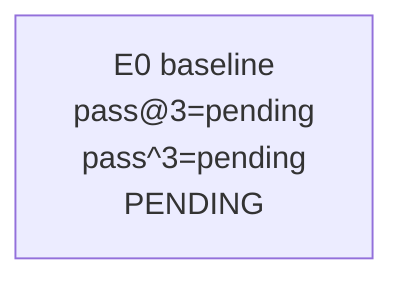

# Smoke-5 Fast-Path Campaign

## Summary

- Campaign: smoke-5 fast-path baseline
- Branch: exp/autoresearch-smoke5-run
- Task list: benchmark/terminalbench/task-lists/smoke-5.txt
- Model: MiniMax-M2.5
- Default k: 3
- Best experiment: pending
- Best pass@k: pending
- Best pass^k: pending
- Best avg_trial_rate: pending

## Commands

```bash
# Pre-warm current code into task images
bash benchmark/terminalbench/prewarm-images.sh \
  --tasks-file benchmark/terminalbench/task-lists/smoke-5.txt \
  --pack-local-tarballs \
  --force

# Run baseline against the pre-warmed images
bash benchmark/autoresearch/run-experiment.sh \
  --tag "E0-baseline-smoke5-k3" \
  --no-local-tarballs \
  -k 3
```

## Experiment Tree



## Experiments

### E0

- Parent:
- Tag: E0-baseline-smoke5-k3
- Commit: pending
- Hypothesis: Establish the first fast-path smoke-5 baseline using pre-warmed
  OAS images and patched verifiers.
- Files changed: none beyond harness and documentation setup
- Command: `bash benchmark/autoresearch/run-experiment.sh --tag E0-baseline-smoke5-k3 --no-local-tarballs -k 3`
- k: 3
- pass@k: pending
- pass^k: pending
- avg_trial_rate: pending
- Decision: pending
- Notes: pending
