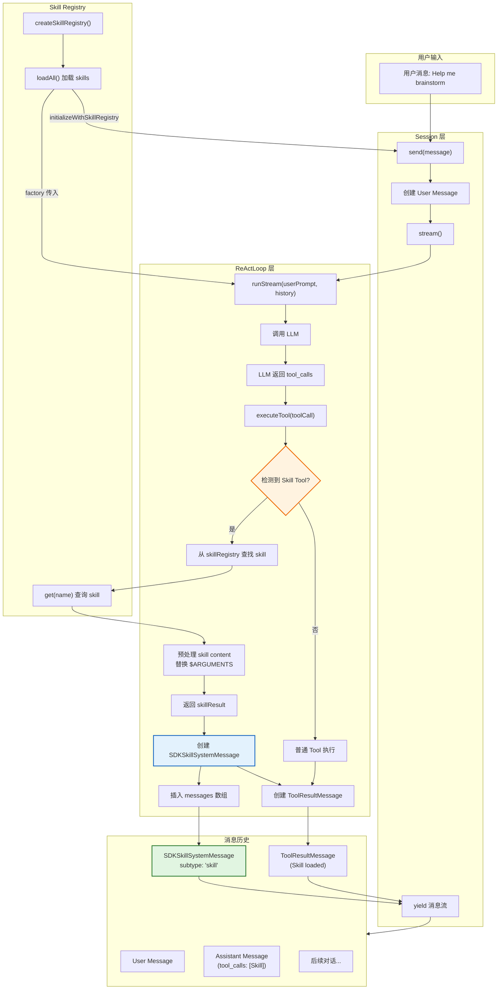

# Skill System Architecture

## 当前实现框图



## 关键组件说明

### 1. Skill Tool (`packages/core/src/tools/skill.ts`)
```typescript
class SkillTool implements Tool<SkillInput, SkillOutput> {
  name = 'Skill'
  // 参数: { name: string }
  // 实际加载逻辑在 ReActLoop 中处理
}
```

### 2. Skill System Message (`packages/core/src/types/messages.ts`)
```typescript
interface SDKSkillSystemMessage extends BaseMessage {
  type: 'system'
  subtype: 'skill'  // 区别于 'init' 和 'compact_boundary'
  skill_name: string
  skill_content: string  // 处理后的 skill 内容
}
```

### 3. ReActLoop 特殊处理 (`packages/core/src/agent/react-loop.ts`)
```typescript
// executeTool 返回类型扩展
Promise<{
  content: string
  isError: boolean
  skillResult?: { name: string; content: string }  // 新增
}>

// Skill Tool 特殊处理逻辑
if (toolCall.function.name === 'Skill' && this.config.skillRegistry) {
  const skill = this.config.skillRegistry.get(skillInput.name)
  // ... 查找、预处理、返回 skillResult
}

// runStream 中插入 system message
if (result.skillResult) {
  const skillSystemMessage = createSkillSystemMessage(...)
  messages.push(skillSystemMessage)
  yield { type: 'skill_system', message: skillSystemMessage }
}
```

### 4. Session 变化 (`packages/core/src/session/session.ts`)

**移除的功能:**
- ❌ `send()` 方法中的 `/skill-name` 解析
- ❌ `getSkillContent()` 调用
- ❌ 将 skill 内容注入 user message

**保留的功能:**
- ✅ `loadSkills()` - 异步加载 skills
- ✅ `skillRegistry` - 存储 registry 实例
- ✅ `getSkillCatalog()` - 获取可用 skills 列表
- ✅ `getSystemPromptWithSkills()` - 在 system prompt 中显示可用 skills

### 5. Factory 初始化 (`packages/core/src/session/factory.ts`)

```typescript
// 创建并加载 skill registry
const skillRegistry = createSkillRegistry()
await skillRegistry.loadAll()

// 传入 ReActLoop
const loop = new ReActLoop(provider, toolRegistry, {
  ...,
  skillRegistry,  // 新增
})

// 初始化 Session
const session = new Session(loop, ...)
session.initializeWithSkillRegistry(skillRegistry)
```

## 数据流对比

### 旧实现 (已移除)
```
用户: /brainstorming idea
      ↓
Session.send() 解析 /command
      ↓
注入 skill 内容到 user message
      ↓
User Message: [Skill: brainstorming]\n\n{content}\n\n[User Message] idea
      ↓
ReActLoop 处理 (单次有效)
```

### 新实现
```
用户: Help me brainstorm
      ↓
Session.send() (无特殊处理)
      ↓
LLM 调用: Skill(name="brainstorming")
      ↓
ReActLoop.executeTool() 特殊处理
      ↓
插入 SDKSkillSystemMessage 到历史
      ↓
Skill 内容作为 system message 持续有效
      ↓
返回 ToolResult: { loaded: true }
```

## 关键设计决策

1. **Skill Tool 是有状态的**: 不同于其他工具只返回结果，Skill Tool 会修改 conversation history

2. **Skill System Message 持久化**: 插入后跟随消息历史，对话压缩时会被保留

3. **与 Claude Code 行为一致**: 通过 `Skill` tool 调用触发，而非 `/command` 解析

4. **$ARGUMENTS 预处理**: 在插入前替换变量（保留向后兼容）

5. **Factory 模式**: SkillRegistry 在 factory 中创建，共享给 Session 和 ReActLoop
